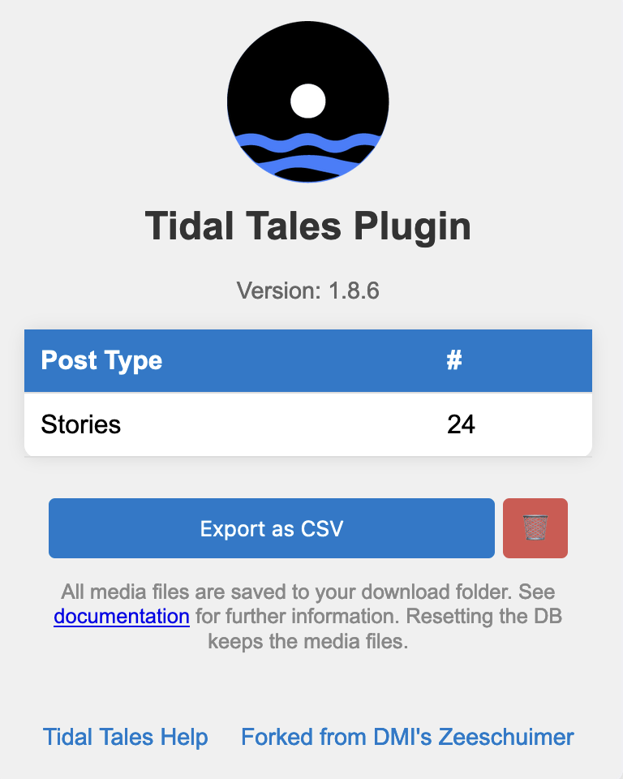

# 💾 Tidal Tales Plugin - Local-Only Real-Time Instagram Stories Capture with Firefox
[](https://zenodo.org/doi/10.5281/zenodo.13383205)
[](https://doi.org/10.48550/arXiv.2409.01880)

<p align="center"></p>

The Tidal Tales Plugin is a modified version of the original [Zeeschuimer project](https://github.com/digitalmethodsinitiative/zeeschuimer) designed to capture Instagram Stories. The project is based on the research and work done by Stijn Peeters for the [Digital Methods Initiative](https://digitalmethods.net).

## Usage 

[Download the latest version of the Tidal Tales Plugin](https://github.com/michaelachmann/tidal-tales-plugin/releases/latest) and install the extension using [Firefox](https://www.mozilla.org/en-GB/firefox/). Once the plugin is installed, start browsing stories. The media files and metadata are downloaded while browsing and stored in your downloads location. When done with the data collection, open the pop-up menu of our plugin and click *Export as CSV* to save a CSV file with all metadata in your download location. The CSV file includes the relative file locations for images and videos. 


## Original Zeeschuimer

The original Zeeschuimer is a browser extension that monitors internet traffic while you are browsing a social media site and collects data about the items you see in a platform's web interface for later systematic analysis. It was primarily intended for researchers who wished to systematically study content on social media platforms that resist conventional scraping or API-based data collection. To learn more about the original Zeeschuimer project, see the original [GitHub repository](https://github.com/digitalmethodsinitiative/zeeschuimer).

## Modifications for Real-Time Data Capture

We removed the 4CAT backend by instantly downloading and saving ephemeral stories (metadata, images, and videos) directly to the local disk using only Firefox. This approach ensures that researchers only store their data on their local machine, avoiding concerns about server-based data protection and removing the need for any additional software.

## Future Work

This research software has been developed rapidly to meet the demands of an ongoing project, and while it may not be perfect, it effectively handles data locally using only Firefox. Since everything runs locally, there's no need for user management or additional backend services. Users are welcome to clone and modify the project to suit their own needs.

## License

The Tidal Tales plugin is licensed under the Mozilla Public License Version 2.0. Refer to the [LICENSE](LICENSE) file for more information.

## Credits

We acknowledges the research and development efforts by Stijn Peeters for the original Zeeschuimer project. The modifications made for implementing the real-time data capture mechanism were carried out by [Michael Achmann-Denkler](https://go.ur.de/michael-achmann) to support his PhD project and teaching at the University of Regensburg.

## Citation
```
Michael Achmann-Denkler. (2024). michaelachmann/tidal-tales-plugin: First Tidal Tales Release (v2.0.0). Zenodo. https://doi.org/10.5281/zenodo.13383206
```
