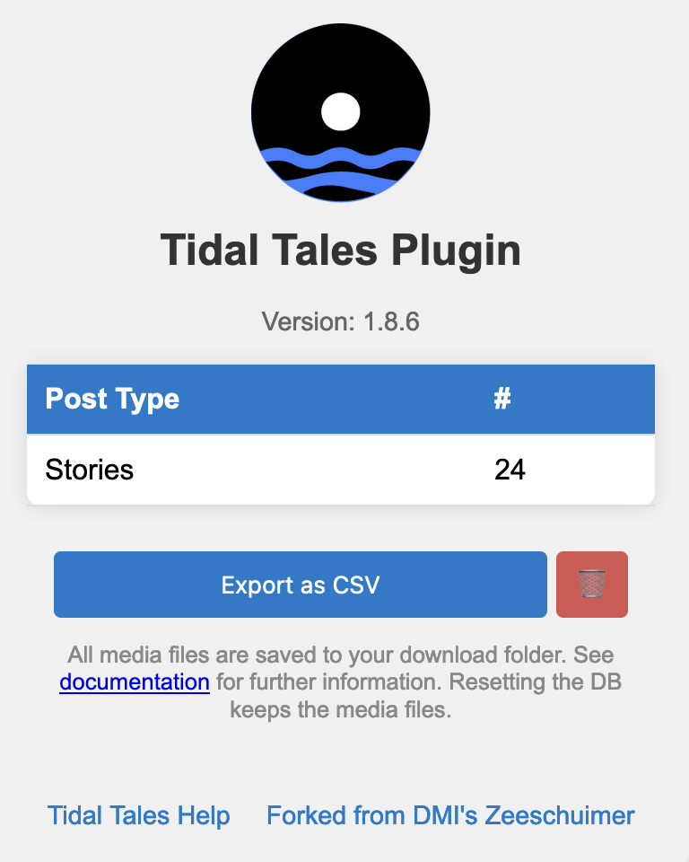

# 💾 Tidal Tales Plugin — Local Instagram and TikTok Capture for Firefox
[](https://zenodo.org/doi/10.5281/zenodo.13383205)
[](https://doi.org/10.48550/arXiv.2409.01880)

<p align="center"></p>

The Tidal Tales Plugin is a modified version of the original [Zeeschuimer project](https://github.com/digitalmethodsinitiative/zeeschuimer) designed to capture Instagram Stories, posts, Reels, and TikTok videos. The project is based on the research and work done by Stijn Peeters for the [Digital Methods Initiative](https://digitalmethods.net).

## Usage

[Download the latest version of the Tidal Tales Plugin](https://github.com/michaelachmann/tidal-tales-plugin/releases/latest) and install the extension using [Firefox](https://www.mozilla.org/en-GB/firefox/). Once the plugin is installed, browse Instagram Stories, posts or Reels, or TikTok videos. The media files and metadata are downloaded while browsing and stored in your downloads location. When done with the data collection, open the pop-up menu of our plugin and click *Export as CSV* to save a CSV file with all metadata in your download location. The CSV file includes file paths relative to your Downloads directory, download outcomes, platform, and content type. Only completed or previously verified downloads appear as saved media paths. Older records are marked as unverified.


## Development build (2.1.0)

To try this checkout, open `about:debugging#/runtime/this-firefox` in Firefox, choose **Load Temporary Add-on**, and select this repository's `manifest.json`. Temporary installations are removed when Firefox restarts. The release download above remains the published version until a new signed release is made.

The collectors reuse the response formats and filtering logic from the local Zeeschuimer checkout. Metadata and media stay on your computer; there is no 4CAT upload or other backend.

Files are written below your Firefox Downloads directory:

- Stories retain `tidaltales/<username>/<id>.json` and media beside it.
- Instagram posts and Reels use `tidaltales/instagram/<username>/<id>.*`.
- TikTok uses `tidaltales/tiktok/<username>/<id>.*`.
- Carousel media have numbered suffixes. Each item has a raw JSON metadata file.

Capture follows data delivered during browsing, including items a platform loads in a batch; it is not proof that every item appeared on screen. Some previews omit video URLs or captions. Opening the individual post can provide richer metadata, which updates a matching capture. Media links can expire or downloads can fail; check the popup and CSV status rather than assuming every file saved. Downloads are queued to limit concurrent work. Keep Firefox running until they finish. Clearing the database keeps downloaded files and does not cancel queued downloads.

The existing local database is retained. Captures are deduplicated within a navigation and platform; revisiting an item may create a new observation while reusing its media file. Raw JSON files refresh when the item is captured again. The Instagram collector labels each item as a Story, post, or Reel.

### Checks

Run the dependency-free regression suite with Node.js:

```sh
node --test tests/*.test.cjs
```

These tests use synthetic platform responses and browser API mocks. They cover parser formats, local download outcomes, capture deduplication, navigation, and CSV handling; they do not replace checking live logged-in Instagram and TikTok in Firefox.

## Original Zeeschuimer

The original Zeeschuimer is a browser extension that monitors internet traffic while you are browsing a social media site and collects data about the items you see in a platform's web interface for later systematic analysis. It was primarily intended for researchers who wished to systematically study content on social media platforms that resist conventional scraping or API-based data collection. To learn more about the original Zeeschuimer project, see the original [GitHub repository](https://github.com/digitalmethodsinitiative/zeeschuimer).

## Modifications for Real-Time Data Capture

We removed the 4CAT backend by instantly downloading and saving ephemeral stories (metadata, images, and videos) directly to the local disk using only Firefox. This approach ensures that researchers only store their data on their local machine, avoiding concerns about server-based data protection and removing the need for any additional software.

## Future Work

This research software has been developed rapidly to meet the demands of an ongoing project, and while it may not be perfect, it effectively handles data locally using only Firefox. Since everything runs locally, there's no need for user management or additional backend services. Users are welcome to clone and modify the project to suit their own needs.

## License

The Tidal Tales plugin is licensed under the Mozilla Public License Version 2.0. Refer to the [LICENSE](LICENSE) file for more information.

## Credits

We acknowledges the research and development efforts by Stijn Peeters for the original Zeeschuimer project. The modifications made for implementing the real-time data capture mechanism were carried out by [Michael Achmann-Denkler](https://go.ur.de/michael-achmann) to support his PhD project and teaching at the University of Regensburg.

## Citation
```
Michael Achmann-Denkler. (2024). michaelachmann/tidal-tales-plugin: First Tidal Tales Release (v2.0.0). Zenodo. https://doi.org/10.5281/zenodo.13383206
```
